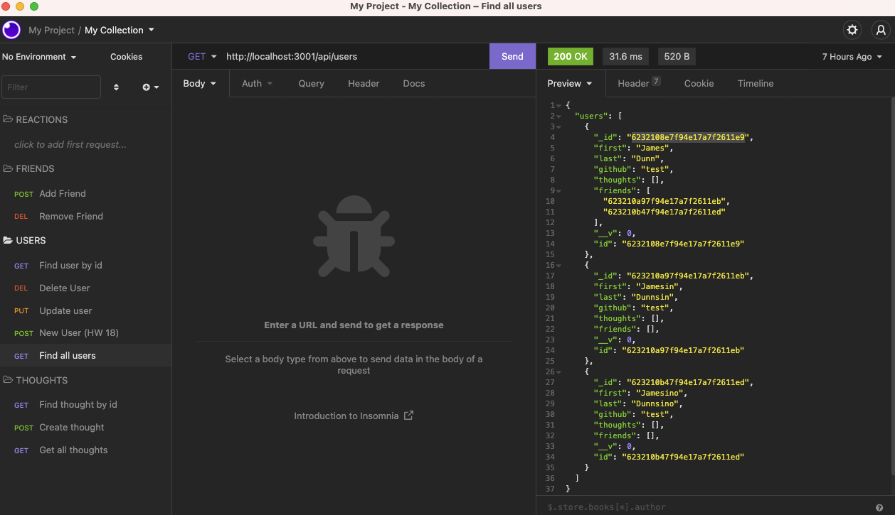

# Social Network API

A social network web application where users can share their thoughts, react to friends’ thoughts, and create a friend list.

## Installation

This application uses MongoDB for the database, Mongoose ODM, and Express.js for routing.

```bash
npm start
```

## Usage

```python
install Mongoose and Express.js
```

## Walkthrough Video

[CLICK HERE](https://drive.google.com/file/d/1qBHQ1bJafx-BYEoRUUMqANOXMqwEnoHN/view)

## Preview



## Contributing

Pull requests are welcome. For major changes, please open an issue first to discuss what you would like to change.

## Github Link

[CLICK HERE](https://github.com/SarahLabrotLientz/Social-Network-API)

## License

[MIT](https://choosealicense.com/licenses/mit/)
